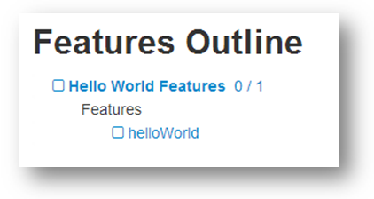

gherkin-runner
==============

And old solution built to run gherkin feature files in the browser.  I am recreating it so that I can review the architecture that was built and use it to help the cucumber-js team.

The list below is a dump of all the details of how the gherkinRunner works:

* Runs completely in the browser.
* You run the application by navigating to 'gherkinRunner.html'
* Uses jQuery, Knockout, and Bootstrap to render the UI.
* Uses require.js to load all features and libraries.
* It has two main interfaces: the Walker and the runner.

##Using the Gherkin Runner

###Launch the Gherkin Runner
###Browse Features
####Expand and Collapse a Feature Set
####View the Feature Set and Feature Count in a Feature Set
####Select and Deselect a Feature Set or Feature
###Load Features
###Navigate the Loaded Features
####Expand and Collapse a Feature Set
####Expand and Collapse the Steps of a Scenario
####Expand and Collapse the Steps of an Example
####View the Step Definition for a Step
####View the Count Summary
###Run All Loaded Features
####View What is Currently Current Running
####View the Counts as They Update
####View the Step, Scenario, and Feature Status Update
###View the Run Results
###View the Results of the Previous Run
###Run A Single Loaded Feature
####Run With Current State
####Reset State And Run
###Set A Breakpoint
###Break On Exceptions
###Pause the Runner
###Cancel the Runner
###Reload the Selected Features
###Return to the Walker from the Runner
###Link to the Selected Features and Feature Sets
###Run a UI Feature
####Toggle Between the UI and the Gherkin Runner
####Move the Run Summary
####Move the Runner Controls (Pause, Start, Cancel)

##Defining Features

###Define a Feature

The first file to create when defining features is a feature file.  The system uses html files to store feature definitions.

1. Create a features folder in the root of the application.   
1. Add a helloWorld.html file.  
1. Add the following content to myFeature.html:  

```
    Feature: Hello World  
      In order to the system is running  
      As a public user  
      I should be able to view a hello world page from the application     
```

You have now created a simple, but empty, feature file.  See Defining a Simple Scenario for creating the first scenario in the file.  

###Define a Simple Scenario

1. Open the helloWorld.html file you created in the previous section.   
1. Update the file to have the following:  
```
    Feature: Hello World  
      In order to the system is running  
      As a public user  
      I should be able to view a hello world page from the application  

    Scenario: View Hello World  
      Given I have a browser open  
      When I navigate to the Hello World Page  
      Then I should see a message of Hello World!   
```

You now have a complete feature file ready to be automated.

###Create a Feature Set

In order for the Gherkin Runner to access your feature and load it, you will need to define a feature set file.  
A feature set file is a javascript file that defines the features that the Gherkin Runner should load.
It can also include references to other feature set files.  This allows your to organize your features into 
a hierarchy.
  
If no feature set file is specified when the Gherkin Runner starts it will look for a generic featureSet.js 
under a features folder.  Path: <root of site>/features/featureSet.js. 

To create this generic feature set file:  

1. Create a file featureSet.js under the public folder.  
1. Add the following code the the file:  
```
    define(function () {  
      return {  
        name: "Hello World Features",  //This is the name that will display in the Gherkin Runner.  
        featureSetPaths: [  
        ],  
        featurePaths: [
          "features/helloWorld" //This is the path to the file without the .html extension.
        ]  
      };  
    });  
```

###Create a Library

When the Gherkin Runner pareses a feature file it loads library files to match the steps to javascript methods.
 A library file is an AMD module that returns an object with methods that the Gherkin Runner will math to the 
 steps in the feature files it parses.  To keep the loading process simple, the Gherkin Runner assumes that each
 folder in the hierarchy between a feature file and the root 'features' folder has a library.js file that it will load.
 When matching steps to methods it will start first with the library file in the feature file's folder and then walk
 up from there till it reaches the root library under the features folder.   

For example, given a feature:  

  * features/folder1/folder1_1/feature.html  

The gherkin runner will load the following libraries:  

  * features/folder1/folder1_1/library.js  
  * features/folder1/library.js  
  * features/library.js  

If it doesn't find any of these libraries it will error out silently.  This is a problem with the way requiejs handles 404's.  

If feature has steps A, B, C, and D and the libraries contained the following methods:  

  * features/folder1/folder1_1/library.js - A  
  * features/folder1/library.js - A, B  
  * features/library.js - A, B, C  

Each step would match to the following methods:  

  * A = features/folder1/folder1_1/library.js - A  
  * B = features/folder1/library.js - B  
  * C = features/library.js - C  
  * D = not found and would show as missing a step definition.  

Before we can run and load our feature we need to add an empty library file.  The steps will not have step definitions
 but the gherkin runner will load the feature so you can browse it in the gherkin runner.

1. You also need to add a library.js file in the root of the features folder as well.  Right now the application
will silently error our if it doesn't find a library file in the root features folder and every folder under till you
get to the feature file. So add a library.js file with the following content:  
```
    define([], function () {
      var _this = {};
      return _this;
    });
```

###Run the Feature before the Step Definition  

After you have created the feature you can run the Gherkin Runner to validate your gherkin syntax.  
  
1. Start the application 'node index.js'  
1. Navigate to the gherkinRunner in a browser:  http://machinename:3000/gherkinRunner.html  
1. You should see your feature listed  



###Create a Step Definition
###Run the Feature
###Define a Step with an Inline Argument
###Define a Step with a Table Argument Step
###Define a Scenario Outline
###Define a Scenario Outline that Nests the Example Arguments 
###Define a Background
###Define a Feature Background
###Define a Feature with an Import
###Define a Step Group for a Step
###Reference an Inline Parameter in a Step Group
###Reference an Inline Parameter in a Table Argument
###Add Comments to a Feature
####Inline Comments
####Full Line Comments
###Use an Expression in a Step
###Add Code Folding in a Feature With Div Tags

##Feature Sets
* The tool is told what features to run via a concept call feature sets.
* Feature Sets are javascript files that use require.js define statements and return an object like the following:
    define(function () {
        return {
            name: "Features", //Name of feature set to display in the tool.
            featureSetPaths: [
                "Features/API/featureSet", //Path to javascript file that contains another feature set definition like this.
                "Features/UI/featureSet",
        ],
            featurePaths: [
                "Features/API/myFeature" //Path to html file that contains the feature definition. 
            ]
        };
    });
* Feature set files define a name to display in the tool as well as paths to either additional feature sets or the actual features.
* Nesting feature sets allows you to organize your features in any way you desire.  
* You can include one feature or feature set in multiple feature sets.
* The feature sets and feature will be executed in the order you add them.
* Feature sets will be loaded before any features included in the feature set.
* You can tell the tool to load a feature set (instead of the default root) by using a featureSetPaths URL parameter with multiple paths separated by comma's.
    http://localhost:3000/gherkinrunner.html?featureSetPaths=features/API/APIRoot/featureSet,features/UI/Login/featureSet
* 
* Loads the list of features by looking for a root level featureSet.js.
* Feature Set definitions are just javascript files that return javascript objects in require define() statements:

* featureSet.js either points to additional featureSet.js files or to feature.html files.
